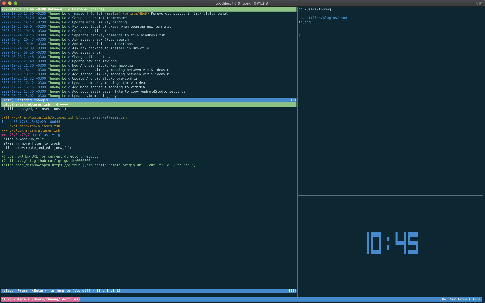

# Welcome to my castle
This is my everyday work. It has my heavy customizations for my Mac. I hope you can find something interesting to see and copy.



## .dotfiles hierarchy

The directories and files hierarchy looks like this:

```unix
.
├── Brewfile
├── init.sh
├── loading_plugins
└── plugins
    ├── android
    │   ├── *.zsh
    │   ├── *.symlink
    │   ├── install.sh
    │   ├── update.sh
    │   └── uninstall.sh
    ├── git
    ├── go
    └── *

```
There's a few special files in the hierarchy.

__topic__ is a plugin inside `plugins` folder, such as `git`, `android`, etc

- __Brewfile__: This is a list of applications and dependencies for [Homebrew Bundle](https://github.com/Homebrew/homebrew-bundle) to install: things like Chrome, 1Password, youtube-dl and stuffs. Might want to edit this file before running any initial setup.

- __init.sh__: Executing script.

- __bin/__: Anything in `bin/` will get added to your `$PATH` and be made
  available everywhere.
  
- __loading_plugins__: the file to configure which plugins you want to install. Might want to edit this file to configure your need. 

- __plugins/__: each child directory inside this folder determines a specific topic with specific configurations and dependencies, such as: android, java, go, ios, macos, vim, etc 

- __topic/**/\*.zsh__: Any files ending in `.zsh` get loaded into your
  environment.
  
- __topic/**/\*.symlink__: Any file ending in `*.symlink` gets symlinked into
  your `$HOME`. This is so you can keep all of those versioned in your dotfiles
  but still keep those autoloaded files in your home directory. These get
  symlinked in when you run `init.sh [install|update]`.
  
- __topic/**/path.zsh__: Any file named `path.zsh` is loaded first and is
  expected to setup `$PATH` or similar.
  
- __topic/**/completion.zsh__: Any file named `completion.zsh` is loaded
  last and is expected to setup autocomplete.

- __topic/**/install.sh__: Any file named `install.sh` is executed when you run `./init.sh install` to do tasks related to installation process. To avoid being loaded automatically, its extension is `.sh`, not `.zsh`.

- __topic/**/update.sh__:  Any file named `update.sh` is executed when you run `./init.sh update` to do tasks related to updating process.
 
- __topic/**/uninstall.sh__: Any file named `uninstall.sh` is executed when you run `./init.sh uninstall` to do tasks related to uninstallation process.


## How to install

```sh
git clone https://github.com/thuongleit/.dotfiles ~/.dotfiles
cd ~/.dotfiles

./init.sh
```

> Note: This is my castle with heavy customizations. I recommend forking this repo, reviewing it and setting your own preferences before installing it. You can pull request them if you want to share your awesome things :).

## Bugs

## Inspired by

[GitHub ❤ ~/](https://dotfiles.github.io/)

